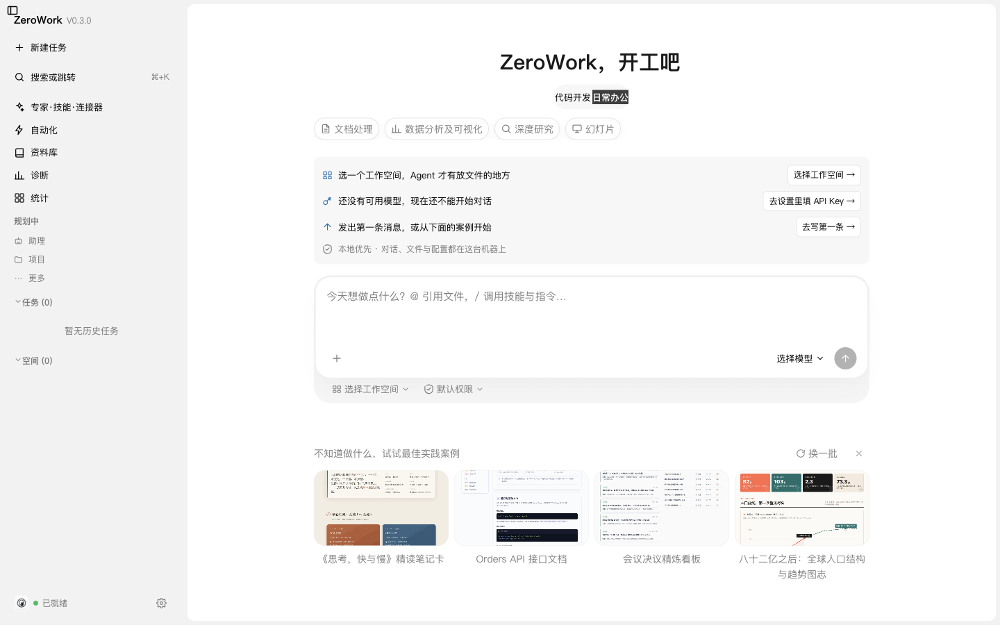
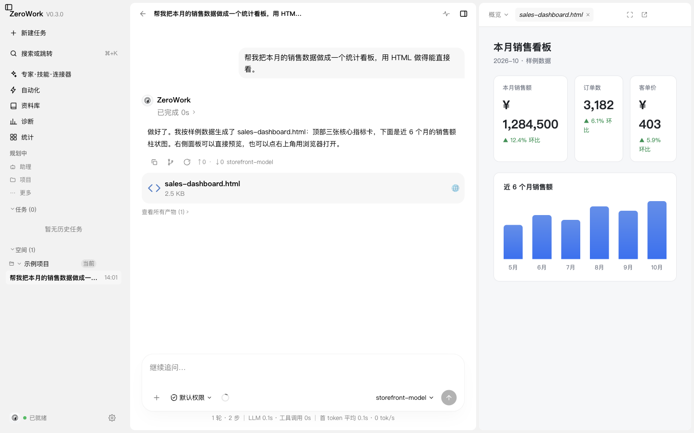
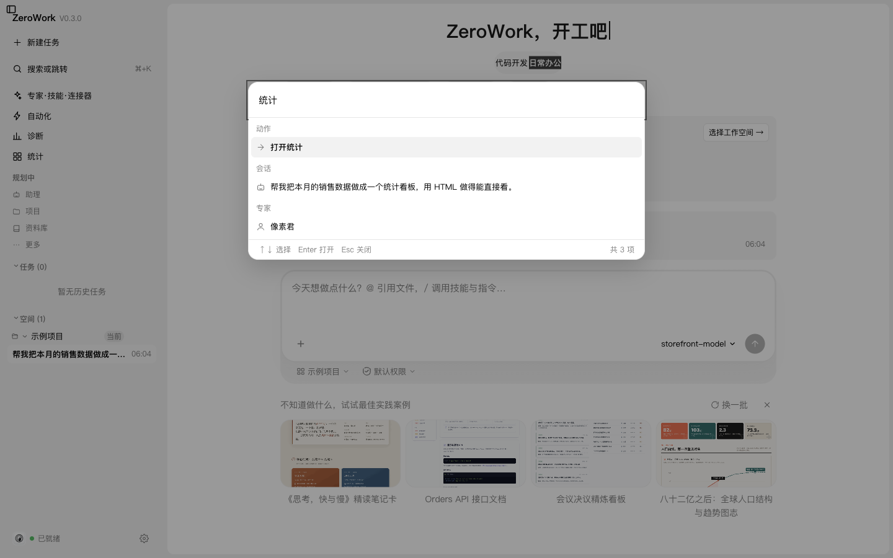
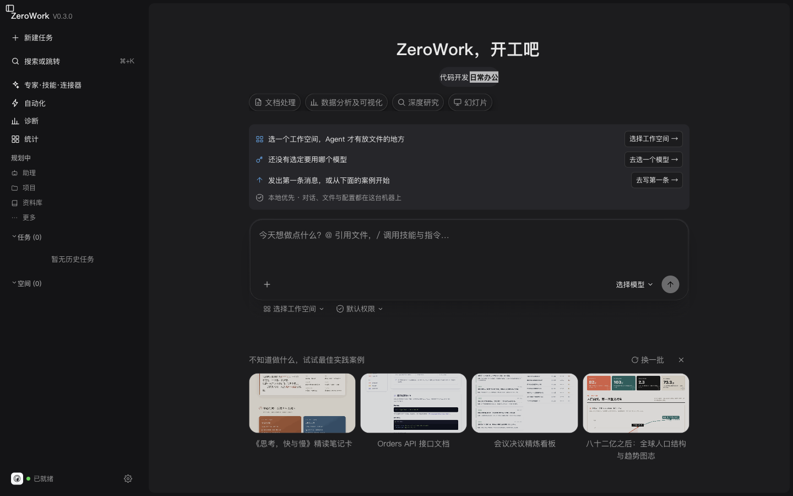

<div align="center">

# ZeroWork

**A local-first AI agent for desktop work** — bringing model capability to your real files and workflows.

[](https://github.com/liang-zhenxiang/zerowork/actions/workflows/ci.yml)
[](https://github.com/liang-zhenxiang/zerowork/releases)
[](https://github.com/ossf/scorecard)
[](LICENSE)
[](CONTRIBUTING.md)

[Quick Start](#quick-start) · [Architecture](docs/ARCHITECTURE.md) · [Contributing](CONTRIBUTING.md)

[中文](README.md) | **English**

> 📖 **Note on language**: the full documentation under `docs/` is written in Chinese,
> where most of this project's design rationale lives. This page covers what you need
> to get started. Contributions that improve the English documentation are welcome.

<br />



</div>

---

## What it does

**It finishes the job.** Hand it a task and it reads your own files, runs commands when a step calls for it, and hands the result back as a finished artifact — not just a block of prose. Your files stay on your machine; everything the app sends outward is itemised in [EXTERNAL_REQUESTS.md](EXTERNAL_REQUESTS.md).



**No menu-hunting.** Press `⌘K` (or `Ctrl+K` on Windows), type a few letters, and land on a session, a setting, or an action.



**The same interface day and night.** Light, dark, or follow the system — three settings, one design.



## What this is

A desktop application that lets an AI agent do real work on your own machine —
reading and writing files, parsing documents, running commands, and executing tasks on a schedule.

- **Electron + React 19**; the agent core is built on
  [`@earendil-works/pi-coding-agent`](https://www.npmjs.com/package/@earendil-works/pi-coding-agent)
- **Provider-agnostic**: any OpenAI-compatible endpoint works, including local models and self-hosted gateways
- **Local-first**: every outbound request is documented in [EXTERNAL_REQUESTS.md](EXTERNAL_REQUESTS.md)
- **Secure by default**: under the restricted permission tiers the app refuses to run a command
  rather than running it unconstrained and silently

> ⚠️ This project is at **0.x**, and **Windows is the only fully supported platform** —
> the command sandbox relies on Windows-specific system calls. On macOS everything except
> command execution works; Linux is not adapted. See [Platform support](#platform-support).
>
> ⚠️ The installers are **unsigned**, so the first launch is blocked by the OS — that is
> expected. See [Installer](#installer) for how to open them.

## Features

| Capability | Description |
| --- | --- |
| **Scenarios** | Code / office work / document processing / data analysis / deep research / slides |
| **Experts & skills** | A dozen packaged experts plus on-demand skills |
| **MCP connectors** | External tools over stdio or HTTP; tool calls always **ask for permission** |
| **Document parsing** | Read and regenerate PDF / Office / DOCX |
| **Scheduled tasks** | Fire a prompt on a schedule, in a fresh session |
| **Sessions** | Archive, branch from **any** historical message, usage accounting |
| **Audit** | Four event categories are recorded — including the act of **erasing the log** |
| **Permissions & sandbox** | Three tiers, model-independent permission evaluation, sandboxed execution |

## Quick start

### Installer

Download from [Releases](https://github.com/liang-zhenxiang/zerowork/releases).

> ⚠️ **The installers are unsigned — being blocked on first launch is expected, not a
> corrupt download.** There is no code-signing certificate, so both macOS Gatekeeper and
> Windows SmartScreen will stop you the first time:
>
> | Platform | What you will see | How to open it |
> | --- | --- | --- |
> | **macOS** | "is damaged and can't be opened" or "cannot verify the developer" | Right-click the icon → **Open**, then click **Open** again in the dialog. If it is still blocked: **System Settings → Privacy & Security**, then click **Open Anyway** |
> | **Windows** | SmartScreen: "Windows protected your PC" | Click **More info** → **Run anyway** |
>
> The **arm64 and x64 dmgs must each be allowed once** — approving one does not approve the other.
> See the [troubleshooting guide](docs/TROUBLESHOOTING.md#安装包被系统拦下) (Chinese).

### From source

```bash
npm ci
npm run dev     # dev mode, renderer hot reload
```

When running unpacked, you must point the app at its resources and config directories:

```bash
ZEROWORK_CONFIG_DIR=/tmp/zerowork-dev \
ZEROWORK_RESOURCES_DIR=$PWD/resources \
npm run dev
```

Then connect a model (**Settings → Model**) — any OpenAI-compatible endpoint.
See the [usage guide](docs/USAGE.md) (Chinese) for details.

With the model connected, put the cursor in the home input and send your first message.
The three-step checklist on the home screen — workspace, model, first message — clears
itself once all three are done.

## Platform support

| Capability | Windows | macOS | Linux |
| --- | :---: | :---: | :---: |
| App shell / UI / IPC | ✅ | ✅ | ✅ |
| Model chat / agent loop | ✅ | ✅ | ✅ |
| Document parsing (PDF / Office / docx) | ✅ | ✅ | ✅ |
| **Command execution** | ✅ sandboxed | ⚠️ refused in restricted tiers | ⚠️ refused in restricted tiers |
| Managed runtimes | ✅ Node / Bash / Python | 🔶 Node / Python | 🔶 Python |

### About the command sandbox

The sandbox calls into Windows' `kernel32` / `advapi32` via `koffi` — it is **Windows-only**.
On macOS and Linux, commands are therefore **refused outright** under the default tier:

**This is a deliberate security decision**: refusing to run is better than running
unconstrained without telling you — otherwise the "restricted" tier would be decorative.

**This is also why there is no Linux installer**: shipping a build that opens a window
but refuses to run commands would be advertising platform support that does not exist.

## Documentation

| Document | Audience |
| --- | --- |
| [docs/USAGE.md](docs/USAGE.md) | **Users** — install, model setup, each area of the UI, permissions, platform differences |
| [docs/TROUBLESHOOTING.md](docs/TROUBLESHOOTING.md) | **Anyone hitting a problem** — search by the error text you saw |
| [docs/ARCHITECTURE.md](docs/ARCHITECTURE.md) | **People changing code** — process model, modules, and *why* it is built this way |
| [docs/DESIGN.md](docs/DESIGN.md) | **People changing the UI** — design-token tiers and the prohibition list |
| [AGENTS.md](AGENTS.md) | **Anyone using an AI assistant on this project** — the condensed development flow and rules (AI tools load it automatically) |
| [.trellis/spec/](.trellis/spec/) | **Before touching a given layer** — per-process coding guidelines (main / daemon / renderer / shared / resources) |
| [CONTRIBUTING.md](CONTRIBUTING.md) | **Contributors** — local checks, commit convention, branching |
| [SECURITY.md](SECURITY.md) | **Anyone reporting a vulnerability** — includes the threat model |

## Technical shape

Two structural facts worth knowing before reading the code (details in [docs/ARCHITECTURE.md](docs/ARCHITECTURE.md)):

1. **The source is JavaScript + JSDoc**; type checking runs through `tsc`, with `checkJs` currently off —
   the reasoning and the incremental path are documented.
2. **The renderer is organised by build chunk, not by component** — `src/renderer/src/app.js`
   alone is ~68k lines. This is deliberate: automatic splitting cannot produce a readable,
   reliable partition, and the rationale plus four manual split candidates are documented.

```bash
npm run test:all    # static checks + unit tests + end-to-end GUI tests
```

## Roadmap

The single source of truth for the roadmap is
**[Roadmap Issue #21](https://github.com/liang-zhenxiang/zerowork/issues/21)**.

## Contributing

Bug reports, documentation fixes and tests are all welcome —
start with [CONTRIBUTING.md](CONTRIBUTING.md).
Look for [`good first issue`](https://github.com/liang-zhenxiang/zerowork/labels/good%20first%20issue)
labels; those issues state which file to start from.

Participation implies agreement with the [Code of Conduct](CODE_OF_CONDUCT.md).

### Maintainers

| Maintainer | GitHub | Email |
| --- | --- | --- |
| liang-zhenxiang | [@liang-zhenxiang](https://github.com/liang-zhenxiang) | 116311683@qq.com |
| nicholyx | [@nicholyx](https://github.com/nicholyx) | nicholyx@163.com |

Both are full maintainers. Feel free to @ either of us in an issue or PR —
but **for security issues, please use the private channel in [SECURITY.md](SECURITY.md)**.

## License

**Apache License 2.0**, see [LICENSE](LICENSE).

This project depends on third-party packages (including `@earendil-works/pi-coding-agent`)
and bundles third-party resources under their own licenses —
all itemised in [THIRD_PARTY_NOTICES.md](THIRD_PARTY_NOTICES.md).

> ⚠️ Items marked as unconfirmed in `THIRD_PARTY_NOTICES.md` must be resolved
> before assuming any right to redistribute.
